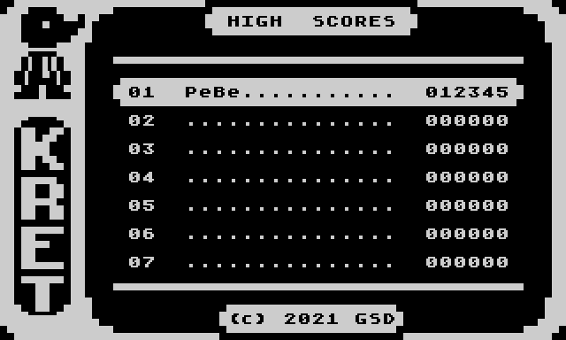
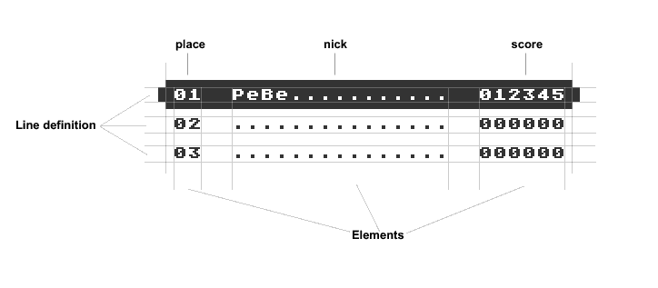
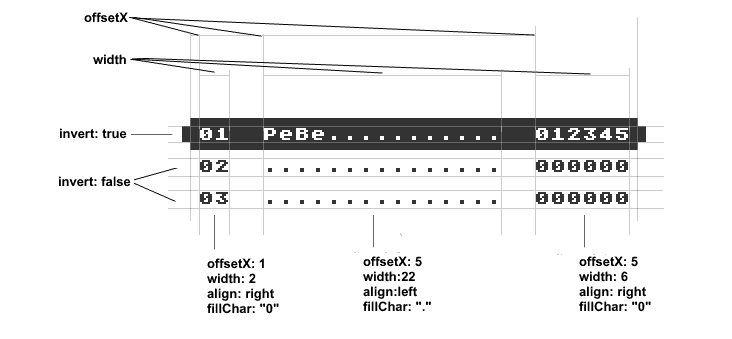
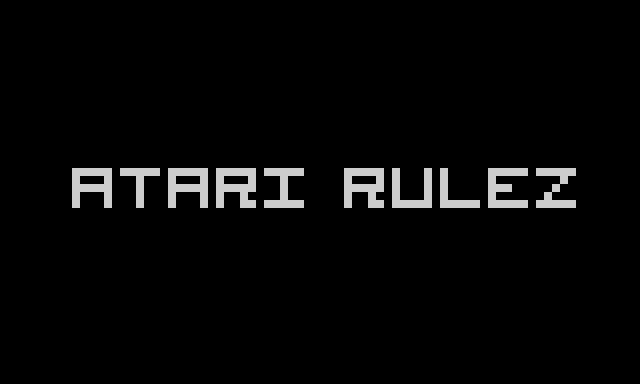
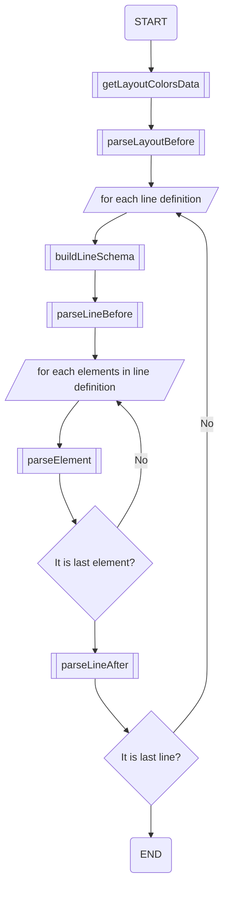
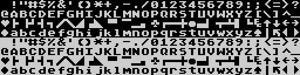

# High Score Cafe AtasciiArt Generator

[TOC]


## Krótko, czym jest HSC

**Hi Score Cafe** (HSC) jest usługą udostępnioną przez *Krzysztofa XXL Dudka*, która gromadzi i prezentuje listy wyników użytkowników z gier, przeznaczonych na 8-bitowe komputery ATARI.

Przesyłanie wyników odbywa się na trzy różne sposoby:

- ręcznie dodanie za pośrednictwem serwisu HSC
- kod **QR** generowany w grze na małym ATARI
- **API HSC**, korzystające z urządzenia **FujiNet**.

Więcej na temat serwisu pod linkiem [Hi Score Cafe](https://xxl.atari.pl/hsc/)


## Czym jest HSC AtasciiArt Generator?

Jest to skrypt rozszerzający możliwości HSC. Dodaje możliwość generowania ekranów dla komputera ATARI z listą wyników danej gry oraz grafiką **AtasciiArt**.




Ekran jest generowany na podstawie przesłanego do serwisu pliku konfiguracyjnego. W postaci czytelnej dla małego ATARI, przesyłany jest do interfejsu **FujiNet** za pośrednictwem sieci Internet. Po odebraniu przez komputer danych, ekran może być wpisany bezpośrednio do pamięci ekranu komputera Atari, bez konieczności przetwarzania informacji.

Atutem takiego rozwiązania są:

- udekorowanie wyników grafiką **AtasciiArt**
- brak konieczności przetwarzania danych JSON po stronie ATARI
- szybki dostęp do listy wyników wielu gier.


# Dokumentacja

Niniejsza dokumentacja zawiera podstawowe informacje dotyczące tworzenia pliku konfiguracyjnego dla rozszerzenia **HSC AtasciiArt Generator** (HSC AAG).


## Co to jest Plik konfiguracyjny?

Jest to plik w formacie JSON. Opisuje on właściwości i elementy generowanego ekranu **AtasciiArt**.

---

**Ważne, aby pamiętać, że wielkość liter w nazwach sekcji, atrybutów oraz ich wartościach MA ZNACZENIE!**

---


## Główna sekcja pliku

Tu zaczyna się przygoda z plikiem konfiguracyjnym.

Ogólny zarys tej sekcji przedstawia poniższy kod:

```JSON
{
    ?atributes,
    ?lineSchemes,
    !layout/!layouts
}
```

### Atrybuty

Są one w większości czysto informacyjne i nie muszą być umieszczone w pliku konfiguracyjnym.

#### `name`

Wartość tego atrybutu zawiera nazwę dla pliku konfiguracyjnego.

#### `author`

Definiuje autora pliku

#### `usePalette`

Ustawia (globalnie) użytą paletę podczas generowania obrazu PNG 

Dostępne są palety:

| Nazwa palety      |
| ----------------- |
| altirra           |
| atari800winplus   |
| g2f               |
| gray              |
| green             |
| jakub             |
| laoo              |
| olivierp          |
| real              |
| rocky_real_atari2 |
| rocky_super_atari |
| xformer           |

### Sekcje

#### `lineSchemes`

Zawiera definicje schematów generowanych linii, patrz [Sekcja `lineSchemes' - Schematy definicji linii](#Sekcja-lineSchemes---Schematy-definicji-linii)

Ta sekcja nie jest wymagana.

#### `layout`

Sekcja definiuje layout, patrz [Sekcja `layout` - Definicja layoutu](#Sekcja-layout---Definicja-layoutu)

#### `layouts`

Umożliwia zdefiniowanie kilku layoutów, tzw. sub layoutów, patrz [Sekcja `layouts` - sub layouty](#Sekcja-layouts---sub-layouty)

<u>W przypadku zdefiniowania także sekcji `layout` ta sekcja ma nad nią priorytet!</u>


## Sekcja `layout` - Definicja layoutu

Z punktu widzenia formatu JSON, `layout` jest obiektem opisującym ekran bazowy. Umieszczone są w nim atrybuty layoutu, definicje generowanych linii oraz ich elementów.

```JSON
{
 "layout":{
     layout_attributes,
     "lines":[
         { // first line
             line_attributes,
             element:{...},
             element:{...},
             ...
         },
         { // secound line
             line_attributes,
             element:{...},
             element:{...},
             ...
         },
		 ...
     ]
 }
}
```

Powyższy przykład, przedstawia schemat definicji layoutu (ekranu). W jego skład wchodzą:

- atrybuty layoutu
- sekcja `lines`


### Atrybuty layoutu

#### Atrybuty wymagane

##### `width`, `height` 

Okresla szerokość i wysokość całkowitą generowanego ekranu w znakach

Domyślna wartość to 40 znaków.

Wartości `width` z zakresu od 1 do 48. Można też używać predefiniowanych wartości:

- `narrow` - szerokość 32 znaki
- `normal` - szerokość 40 znaków
- `wide` - szerokość 48

Wartość `height` od 1 do 30.

##### `lines` 

Tablica obiektów opisująca generowane linie (patrz [Sekcja `lines - Definicje linii`](#Sekcja-lines---Definicje-linii))

#### Opcjonalne atrybuty

##### `name` 

Nazwa dla layoutu.

##### `author`

Twórca layoutu.

##### `colors` 

Tablica reprezentująca ustawienia kolorów dla wartości rejestrów kolorów ATARI (od 708 do 712)

##### `usePalette` 

Ustawia paletę kolorów dla generowanego obrazu PNG.  Jezeli atrybut nie jest określony, zastosowana zostanie paleta zdefiniowana w głównej sekcji pliku konfiguracyjnego.

##### `encodeLinesAs` 

Określa sposób wyjściowego kodowania treści generowanych linii

---

Z natury rzeczy, ekran bazowy to nic innego jak ekran komputera Atari. Jest on standardowo kodowany z użyciem kodów ANTIC. Jednak można go też opisać używając standatu ATASCII.

W tym celu, należy zaznaczyć w jaki sposób będą kodowane, generowane linie.

---

Dostępne wartości: `atascii`, `antic`

Domyślna wartość: `antic`

##### `screenData` 

Tablica ciągów heksadecymalnych.

Atrybut ten zawiera opis ekranu bazowego. Standardowo można zapisać cały ekran w postaci jednego ciągu znaków hexa, np.

```JSON
...
layout:{
    screenData:["0049494949494949494949494949494949494949494949494949494949494949494949494949490049004C4C4C4C4C4C4C4C4C4C4C4C4C4C4C4C4C4C4C4C4C4C4C4C4C4C4C4C4C4C4C4C4C4C4C4C4C00494C004955550049554F0055550055554F4955554F49554F495555000000494F0049554F0000494C494C00D9C9CF5980D580D9C9C...
0000000000000000000000000000000000000000000000000000000000000000000494C494C494949494949494949494949494949494949494949494949494949494949494949494949004C00004C4C4C4C4C4C4C4C4C4C4C4C4C4C4C4C4C4C4C4C4C4C4C4C4C4C4C4C4C4C4C4C4C4C4C4C4C00"]
}
```

Jednak trudno się odnieść do tak ułożonych danych. Można sobie trochę pomóc, formatując dane w postaci wielu linii:

```json
"screenData": [
"00494949494949494949494949494949494949494949494949494949494949494949494949494900",
"49004C4C4C4C4C4C4C4C4C4C4C4C4C4C4C4C4C4C4C4C4C4C4C4C4C4C4C4C4C4C4C4C4C4C4C4C4C00",
"494C004955550049554F0055550055554F4955554F49554F495555000000494F0049554F0000494C",
...
"494C000000000000000000000000000000000000000000000000000000000000000000000000494C",
"494C000000000000000000000000000000000000000000000000000000000000000000000000494C",
"494C494949494949494949494949494949494949494949494949494949494949494949494949004C",
"00004C4C4C4C4C4C4C4C4C4C4C4C4C4C4C4C4C4C4C4C4C4C4C4C4C4C4C4C4C4C4C4C4C4C4C4C4C00"
]
```


##### `screenFill`

Definiuje znak, jakim będzie wypełniony ekran bazowy w przypadku, braku atrybutu `screenData`


## Sekcja `lines` - Definicje linii

Jest to tablica obiektów (w rozumieniu pliku JSON). Każdy obiekt w tej sekcji, definiuje osobną, generowaną linię w ekranie bazowym.

Treść generowanej linii jest obcinana do jej szerokości oraz wysokości.

W sekcji tej, definiowane są też elementy wchodzące w skład linii.



#### Atrybuty wymagane

##### `x` i `y` 

Określają początkowe położenie linii w ekranie bazowym

#### Opcjonalne atrybuty

##### `width` oraz `height` 

Definiuje szerokość i wysokość linii.

Domyślne wartości to: `height` = 1. Jeśli chodzi o `width` to ta wartość domyślnie dobierana jest na podstawie różnicy szerkości generowanego ekranu, a wartości X połoźenia linii.

##### `invert`

Ustawiony na `true`, dokonuje inwersji (operacja XOR na 7 bicie każdego znaku)  w wynikowej linii


### Elementy linii

Typ generowanego elementu zawarty jest w nazwie atrybutu obiektu opisującego generowaną linię tablicy `lines`

```JSON
{
 "layouts":{
  "default":{
   "lines":[
    {
     "x": 1,
     "y": 1,
     "width": 20,
     "element_type": {
      {element_attributes}
     },
     "element_type": {
      {element_attributes}
     },...
    },...
   ]
  }
 }
}
```


### Rodzaje elementów

#### `place` 

Miejsce z tablicy wyników

#### `nick` 

Nazwę gracza (jego nick)

#### `score` 

Osiągnięty wynik

#### `date` 

Data rejestracji wyniku

#### `text`

Generuje dowolny tekst

#### `genTime` 

Generuje czas utworzenia ekranu


#### Etykiety

Każdy element może posiadać etykietę. Jej nazwę definiujemy zaraz po typie elementu, poprzedzając ją znakiem kropki.

```JSON
{
 "text.label":{...}
}
```

Jest ona wymagana w przypadku chęci wstawienia kilku elementów tego samego typu w jednej definicji linii.


### Atrybuty opisujące element

Poniższe atrybuty nie są wymagane, gdyż w przypadku ich braku, wybierana jest wartość domyślna, jednak warto nad nimi panować, celem osiągnięcia zamierzonego efektu.



#### `offsetX` i `offsetY`

Definiują przesunięcie poziome oraz pionowe względem początku linii (w znakach)

Wartości domyślne dla obu atrybutów wynoszą 0 (zero)


#### `width` i `height`

Ustalają szerokość i wysokość generowanego elementu (w znakach)

Wartościami domyślnymi dla atrybutów `width` i `height` są, szerokość i wysokość definiowanej linii. 


#### `align`

Justowanie zawartości elementu, względem jego szerokości.

Możliwe wartości to: `left`, `center`, `right`.

Wartość `right` jest domyślna.


#### `fillChar`

Określna znak, jakim będzie wypełniony element na całej jego szerokości.

Domyślną wartością jest znak #32 (spacja)


#### `letterCase`

Pozwala na konwersję wielkości liter.

Możliwe wartości: `uppercase`,`lowercase`


#### `limitChars`

Zawiera listę znaków, jaka będzie akceptowana przy generowaniu elementu. Jego opis to wartość typu string, zawierająca wszystkie akceptowane znaki.

W parze z tym atrybutem jest atrybut `replaceOutsideChars`.

Domyślnie akceptowane są wszystkie znaki.


#### `replaceOutsideChars` 

Ten atrybut określa znak, jaki będzie wstawiany w przypadku, gdy znak generowanego elementu nie należy do zakresu określonego w atrybucie `limitChars`.

Domyślną wartością jest #32 (spacja)


#### `invert` 

Działa tak samo jak atrybut `invert` w sekcji `layout` z tą różnicą, że stosowany jest tylko do generowanego elementu.


#### `useAtasciiFont` 

Generuje treść elementu z użyciem **AtasciiFont** (patrz dział [AtasciiFont](#AtasciiFont))


#### `isEntry`

Atrybut wskazujący na pobranie wyniku z tablicy wyników.

Przyjmuje dwa typy wartości:

- `boolean` - określające, czy pobierać wynik z tablicy wyników (wartość `true`, czy też nie (wartość `false`).

- `integer` - określająca, który wynik z tablicy wyników ma być pobrany

  **UWAGA!** Atrybut nie sprawdza zakresu!


Ustalenie tego atrybutu tyczy się aktualnie definiowanej linii. Po przejściu do następnej, numer miejsca wyniku jest automatycznie zwiększany o jeden. Ustawienie wartości `false` powoduje, niezwiększanie numeru miejsca dla następnej linii.

Domyślną wartością jest `true`


### Dedykowane atrybuty elementów

Spośród wszystkich elementów można wybrać takie, które mają przypisane dodatkowe atrybuty. Takimi elementami są:

- `date`

- `genTime`

- `text`

  

#### Element `date`

##### `format`

Jest to ciąg znaków opisujących sposób, w jaki ma być interpretowana data powstania wyniku. Domyślnie stosowany jest format `Y.m.d`

Funkcją formatującą czas jest funkcja języka PHP `date()`. Jej opis znajdziesz [tu](https://www.php.net/manual/en/function.date.php), a możliwe opcje formatowania [tu](https://www.php.net/manual/en/datetime.format.php).


#### Element `genTime`

Wyświetla serwerowy czas utworzenia ekranu.

##### `format`

Patrz opis atrybutów elementu `date`


#### Element  `text`

##### `content`

Użyj atrybutu `content` celem, określenia treści generowanego tekstu. Treść jest automycznie przycinana z obu stron pod kątem białych znaków.

```JSON
...
"lines":[
    {
        "x":0,
        "y":10,
        "height":5,
        "text":{
            "align":"center",
            "content":"ATARI RULEZ",
            "useAtasciiFont":"square-slim"
        }
    }
]
...
```



W treści atrybutu, może być użyty parametr, np:

```JSON
...
"text":{
    content:"%id"
}
...
```

W miejscu `id` nalezy użyć identyfikatora, jaki zaostał użyty do przekazania parametrów do skryptu (patrz [Przekazywanie parametrów do HSC AAG](#Przekazywanie-parametrów-do-HSC-AAG))


## Sekcja `lineSchemes` - Schematy definicji linii

Aby ułatwić projektowanie layoutu oraz zwiększyć czytelność pliku konfiguracyjnego, można stosować **schematy definicji linii**.

Ich definicje opisuje się w głównej części pliku konfiguracyjnego w sekcji `lineSchemes` i jest ona obiektem w którym zawarte są poszczególne schematy.

Każdy schemat jest obiektem i musi być nazwany, np:

```JSON
{
  ...
  "lineSchemes": [
    "my_schema": {
      ...
    }
  ],
  ...
}
```

W definicji schematu można stosować wszystkie elementy i ich atrybuty, które zostały wymienione w sekcji [Elementy linii](#Elementy-linii).

Użycie schematu jest banalnie proste. W definicji linii wyniku wstawiamy atrybut `useSchema` któremu przypisujemy nazwę zdefiniowanego schematu (wielkość liter ma znaczenie!)

```JSON
{
 ...
 "lineSchemes": [
  "my_schema": {
   "x": 5,
   "width": 20,
   "place": {
    "shift": 1,
    "width": 2
    "align": right
   },
   ...
   "invertLine": false
  }
 ],
 "layouts": {
  "default":{
   ...
   "lines":[
    {
     "y": 5,
     "useSchema": "my_schema",
     "invert": true
    },
    {
     "y": 7,
     "useSchema": "my_schema"
    }
    ...
   ]
  }
  ]
}
```

Elementy i atrybuty zdefinsiowane w linii wyniku mają priorytet nad schematem, dzięki czemu, można nadpisywać ustawiane przez schemat cechy.


## Sekcja `layouts` - sub layouty

Sposób definiowania poszczególnych ekranów przedstawia poniższy, plik konfiguracyjny:

```JSON
{
 "layouts":{
  "default":{
   ...
  },
  "layout_1":{
   ...
  },
  "layout_1":{
   ...
  }
 }
}
```

Powyższy przykład, przedstawia poglądową definicję trzech ekranów (sub layoutów):

- nazwa `default` jest zarezerwowana dla domyślnego wyglądu
- `layout_1` i `layout_2` są dodatkowymi ekranami

Atrybuty layoutu, definicje linii oraz ich elementów, pozostają takie same, jak w przypadku [sekcji `layout`](#Atrybuty-layoutu).


# AtasciiFont

**AtasciFont** to czcionki wykorzystujące zestaw znaków Atascii z małego ATARI.

W połączeniu z **HSC AtasciiArt Generator** zwiększają one możliwości kreowania ekranów i można je wykorzystać w każdym aspekcie na jaki pozwala HSC AAG.

## Dostępne czcionki

Obecnie stworzonych jest 8 czcionek.

| Nazwa pliku        | Nazwa czcionki     | Rozmiar |                        Przykład                        |
| ------------------ | ------------------ | :-----: | :----------------------------------------------------: |
| cosmic-line-2.json | Cosmic SquareLined |   3x3   |  |
| cosmic-line.json   | Cosmic Lined       |   3x4   |    |
| cosmic.json        | Cosmic             | 3(4)x3  |         |
| handwrite.json     | Handwrite          |   3x5   |      |
| round.json         | Round              | 3(4)x3  |          |
| square-bold.json   | Square Bold        | 3(4)x3  |    |
| square-slim.json   | Square Slim        |   3x3   |    |
| ultra-future.json  | Ultra Future       |   4x4   |   |

---

**Uwaga!** Nie wszystkie czcionki zawierają definicjie: małych liter oraz znaków interpunkcyjnych! Użycie niezdefiniowanego znaku, spowoduje jego nie wyświetlenie.

Zobacz [katalog podglądu czcionek](./AtasciiFonts/png_preview/), aby zobaczyć, jakie znaki są zdefiniowane w czcionkach.

---


## Jak korzystać z czcionek AtasciiFont w HSC AAG?

Aby użyć czcionki **AtasciFont** w pliku konfiguracyjnym, należy w definicji elementu umieści atrybut `useAtasciiFont`. W jego parametrze należy podać nazwę pliku czcionki bez rozszerzenia `.json`, np.

```JSON
...
"text":{
    "content":"HELLO ATARIANS",
    "useAtasciiFont": "cosmic-line-2"
}
...
```


Należy też pamiętać o dobraniu wysokości linii do wysokości czcionki, gdyż skrypt nie robi tego automatycznie. W przeciwnym wypadku czcionka będzie ucięta.

```JSON
...
"lines":{
    height:3,
    "elements":{
        "text":{
            "content":"HELLO ATARIANS",
            "useAtasciiFont": "cosmic-line-2"
        }
    }
}
...
```

Wszelkie atrybuty dostosowujące treść elementu są akceptowane dla **AtasciiFont**.


# Dla deweloperów

Na projekt HSC AAG składają się następujące katalogi i pliki:

| Nazwa                     | Opis                                                         |
| ------------------------- | ------------------------------------------------------------ |
| `/AtasciiFonts`           | definicje czcionek **AtasciiFont** oraz ich źródła i obrazy poglądowe |
| `/config_files_examples`  | przykłady i źródła plików konfiguracyjnych                   |
| `/default_configs`        | katalog z definicjami domyślnych plików konfiguracyjnych     |
| `/user_configs`           | zawiera pliki konfiguracyjne użytkowników                    |
| `_constants.php`          | definicje stałych dla klasy `AtasciiGen`                     |
| `_polyfill.php`           | funkcje zapewniające kompatybilność ze starszymi wersjami PHP |
| `_string_helpers.php`     | funkcje pomocnicze do operowania na ciągach znaków           |
| `class_AtasciiFont.php`   | klasa generująca tekst z użyciem czcionek **AtasciiFont**    |
| `class_AtasciiGen.php`    | klasa bazowa, generująca ekrany **AtasciArt**                |
| `class_HSCGenerator.php`  | rozszerzenie klasy bazowej, dostosowyujące do wymogów **HSC** |
| `example-AtasciiFont.php` | przykład użycia klasy `AtasciiFont`                          |
| `example.php`             | przykad użycia klasy `HSCGenerator`                          |
| `atari_8.png`             | obraz z graficzną reprezentacją znaków Atascii (rozmiar piksela 1x1) |
| `atari_16.png`            | j.w. (rozmiar piksela 2x2)                                   |


## Budowa klasy `AtasciiGen`

### Właściwości klasy

###  `$confFN`

| Widoczność | Typ    |
| ---------- | ------ |
| public     | string |

Przechowuje nazwę otwartego pliku konfiguracyjnego.

### `$params`

| Widoczność | Typ   |
| ---------- | ----- |
| public     | array |

Jednowymiarowa tablica asocjacyjna zawierająca parametry które będą mogły być odczytane przez plik konfiguracyjny.

Asocjacja odbywa się poprzez klucz i jego wartość, gdzie nazwa klucza jest identyfikatorem parametru.


### `$screenDef`

| Widoczność | Typ    |
| ---------- | ------ |
| private    | string |

Zmienna przechowująca wygenerowany ekran w postaci ciągu znaków Atascii. Rozmiar ciągu ustalany jest na podstawie wartości przekazanych przez plik konfiguracyjny w atrybutach layoutu `width` i `height` i jest on równy iloczynowi tych atrybutów.

### `$config`

| Widoczność | Typ   |
| ---------- | ----- |
| private    | array |

Zawiera zdekodowany do referencyjnej tablicy asocjacyjnej plik konfiguracyjny JSON.

### `$schemes`

| Widoczność | Typ   |
| ---------- | ----- |
| private    | array |

Referencja do obiektu `$config['linesScheme']` zawierająca definicje schematów linii.

### `$screenWidth` i `$screenHeight`;

| Widoczność | Typ     |
| ---------- | ------- |
| private    | integer |

Szerokość `$screenWidth` i wysokość `$screenHeight` generowanego ekranu. Wartości tych zmiennych ustalane są z definicji layoutu pliku konfiguracyjnego

### `$curLineX` i`$curLineY`

| Widoczność | Typ     |
| ---------- | ------- |
| private    | integer |

Zmienne zawierają położenie lewego górnego rogu (kolumnę `$curLineX` i wiersz `$curLineY`) aktualnie przetwarzanej linii definicji layoutu.

### `$curLineWidth` i `$curLineHeight`

| Widoczność | Typ     |
| ---------- | ------- |
| private    | integer |

Zawierają wymiary (szerokość `$curLineWidth` i wysokość `$curLineHeight`) aktualnie przetwarzanej linii definicji layoutu.

### `$currentLineData`

| Widoczność | Typ    |
| ---------- | ------ |
| protected  | string |

Bufor (ciąg znaków), przeznaczony dla każdej generowanej linii. której indeks reprezentuje numer przetwarzanej linii definicji layoutu.

Jego organizacja jest liniowa i może zawierać więcej niż jedną linię, która jest częścią ekranu. Ilość zawartych w buforze linii, jest determinowana na podstawie wysokości `$this->$curLineWidth` aktualnie definiowanej linii. Podobnie jest z szerokością - tą ustala szerokość `this->$curLineHeight` aktualnie definiowanej linii.

W rezultacie, rozmiar bufora to iloczyn szerokości i wysokości definiowanej linii.

### `$elParams`

| Widoczność | Typ   |
| ---------- | ----- |
| private    | array |

Zawiera atrybuty aktualnie przetwarzanego elementu definicji linii.

Jest to tablica asocjacyjna, której kluczem są nazwy atrybutów, a wartości ich parametrem.

### `$palette`

| Widoczność | Typ   |
| ---------- | ----- |
| public     | array |

Tablica której zawartość ustala metoda `$this->loadPalette()`.

Składa się z 256 indeksów w których są zapisane wartości RGB dla każdego indeksu:

```JSON
{
    0:[0,0,0],
    1:[0,0,0],
    ...
}
```


### `$colorReg`

| Widoczność | Typ   |
| ---------- | ----- |
| public     | array |

Tablica zawierająca wartości rejestrów (zgodnie z systemem ATARI 8-bit). Kluczem tablicy jest numer rejestru od 708 do 712, wartością wartość koloru.

Tablic ustawiana jest przez metodę `$this->getLayoutColorsData()` a ta, wywoływana jest przez `$this->generate()`


### Metody klasy

####  __construct

| Widoczność |
| ---------- |
| public     |

| parametr | type   | wartość domyślna |
| -------- | ------ | ---------------- |
| `$fn`    | string | brak             |

Konstruktor, wczytujący i dekodujący plik konfiguracyjny w formacie JSON. W przypadku nieznalezienia pliku lub błędu w jego składni, funkcja wyrzuca wyjątek.

Ustala też tablicę layoutów oraz schematów linii.

#### getScoreboardEntry

| Widoczność |
| ---------- |
| public     |

| parametr | type    | wartość domyślna |
| -------- | ------- | ---------------- |
| `$place` | integer | brak             |

Metoda którą trzeba nadpisać poprzez rozszerzenie klasy `AtasciiGen`. Jej wywołanie wyrzuca wyjątek.

Funkcja jaką pełni to, pobieranie pojedynczego wyniki z tablicy wyników.

### getScreenDataFromLayout

| Widoczność |
| ---------- |
| private    |

Metoda generująca ekran bazowy na podstawie atrybutów definicji layoutu `screenData` oraz `screenFill`.

`screenData` może być ciągiem znaków lub tablicą ciągów znaków. Treść ciągów to 8-bitowe wartości zapisane w systemie szesnastkowym opisujące znak po znaku (w jednym z dwóch standardów ATASCI lub ANTIC) ekran bazowy. 

### rangeCheck

| Widoczność |
| ---------- |
| private    |

| parametr  | type    | wartość domyślna |
| --------- | ------- | ---------------- |
| `$value`  | integer | brak             |
| `$min`    | integer | brak             |
| `$max`    | integer | brak             |
| `$errMsg` | string  | brak             |

Metoda do kontroli zakresu wartości liczbowej, przekazywanej w parametrze `$value` . Zakres ustalany jest przez parametry `$min` i `$max`.

Metoda generuje wyjątek w przypadku przekroczenia zakresu, a treść tego wyjątku jest podawana w parametrze `$errMsg`. Do treści wyjątku "doklejana" jest informacja o oczekiwanym zakresie.


### checkExist

| Widoczność |
| ---------- |
| private    |

| parametr   | type     | wartość domyślna                   |
| ---------- | -------- | ---------------------------------- |
| `$value`   | any type | brak                               |
| `$default` | integer  | null                               |
| `$errMsg`  | string   | `"Some atrribut is not specified"` |

Metoda kontrolująca istnienie parametru. Jest nieco "kontrowersyjna", gdyż opiera się o tryb "silent" PHP (operator @). W tym trybie, nie są generowane błędy, a wartość zwracana przez nieistniejący paramert przyjmuje `null`.Należy go dołączyć do przekazywanego parametru `$vaue`, np.

```PHP
$this>checkExist(@$this->config['name'], null);
```

Może reagować na dwa sposoby:

- generować wyjątek z komunikatem określonym w parametrze `$errMsg`. Ten sposób dostępny jest gdy, parametr `$default`
- przypisywać wartość `$default`, jeżeli `$value` 


### parseLayoutBefore

| Widoczność |
| ---------- |
| protected  |

| parametr       | type  | wartość domyślna |
| -------------- | ----- | ---------------- |
| `&$layoutData` | array | brak             |

Metoda pomocnicza.

Metoda ustalająca atrybuty layoutu. Wywoływana przed rozpoczęciem generowania ekranu (metoda `generate()`)

Sprawdza istnienie atrybutów `width`, `height`,`screenData`,`screenFill` w przekazywanej referencji `$layoutData` . Przypisuje zdefiniowane wartości lub dobiera wartości domyślne dla tych atrybutów.


### buildLineSch#ema

| Widoczność |
| ---------- |
| protected  |

| parametr    | type  | wartość domyślna |
| ----------- | ----- | ---------------- |
| `&$lineDef` | array | brak             |

Metoda pomocnicza.

Metoda wywoływana jest na początku każdej zdefiniowanej linii i buduje schemat linii na podstawie atrybutu `useSchema`. Sprawdza jego istnienie w sekcji `lineSchemes` i dodaje atrybuty schematu do aktualnej definicji linii, której dane przekazywane są w parametrze referencyjnym `$lineDef`. Jeżeli definicja linii zawiera atrybut, który jest zawarty w schemacie, jego wartość ma pierwszeństwo.

Brak definicji schematu w sekcji `lineSchemes` spowoduje wywołanie wyjątku o treści `Schema ... is not defined!`


### parseLineBefore

| Widoczność |
| ---------- |
| protected  |

| parametr          | type  | wartość domyślna |
| ----------------- | ----- | ---------------- |
| `&$currentSchema` | array | brak             |

Metoda pomocnicza.

Sprawdza i ustawia właściwości dla generowanej linii. Atrybuty testowane są w przekazanym do metody parametrze referencyjnym `$currentSchema`i są nimi: `x`, `y`, `width`, `height`, `fillChar`, `isEntry`. 

Metoda wywoływana jest tuż przed generowaniem elementów.

### parseLineAfter

| Widoczność |
| ---------- |
| protected  |

| parametr          | type  | wartość domyślna |
| ----------------- | ----- | ---------------- |
| `&$layoutData`    | array | brak             |
| `&$currentSchema` | array | brak             |

Metoda pomocnicza.

Przekazane w parametrach metody zmienne referencyjne `$layoutData` oraz `$currentSchema` sprawdzane są pod kątem atrybutów `invert` oraz `encodeLnesAs` i przetwarzane są końcowe parmetry generowanej linii.

Metoda wywoływana jest po skończeniu przetwarzania elementów zawartych w definicji linii.

### generate

| Widoczność |
| ---------- |
| public     |

Generuje ekran na podstawie danych pliku konfiguracyjnego.

Wykonuje metody pomocnicze w następującej kolejności:



Każda wygenerowana linia jest wpisywana w bazowy ekran `$this->screenDef`. Na podstawie zmiennych `$this->curLineX`, `$this->curLineY`, `$this->curLineWidth` obliczny jest offset początku zapisywanych danych. Z bufora linii `$this->currentLine` zastępowane są dane w ekranie bazowym.

### createElement

| Widoczność |
| ---------- |
| private    |

| parametr | type   | wartość domyślna |
| -------- | ------ | ---------------- |
| `&val`   | string | brak             |

Generuje treść elementu definicji linii na podstawie zebranych przez metody pomocnicze informacji oraz przekazanego parametru `$val`, który zawiera tekst.

Sprawdza istnienie atrybutów elementu `useAtasciFont`, `offsetX`, `offsetY`, `width`, `height`, `align`, `letterCase`, `fillChar`, `limitChar`, `invert`. W przypadku braku któregoś z nich, ustawia wartości domyślne.

Generowany element wpisywany jest do bufora linii `$this->currentLineDef`.

### parseElement

| Widoczność |
| ---------- |
| protected  |

| parametr      | type   | wartość domyślna |
| ------------- | ------ | ---------------- |
| `$elType`     | string | brak             |
| `$scoreEntry` | array  | brak             |
| `$label`      | string | null             |

Metoda pomocnicza.

Wywołuje na podstawie typu elementu zawartego w parametrze `$elType` metodę `createElement`, przekazując do niej odpowiedni ciąg znagów do wygenerowania.

Parametr `$scoreEntry` zawiera dane jedenego wiersza tablicy wyników. Informacje te, pobierane są na podstawie wartości atrybutu `isEntry` definicji linii. Ten, ustalany jest w metodzie pomocniczej `parseLineBefore`

Do metody przekazywany jest też przypisana do elementu etykieta (parametr `$label`)

### makeImage

| Widoczność |
| ---------- |
| public     |

| parametr             | type   | wartość domyślna    |
| -------------------- | ------ | ------------------- |
| `$imageFile`         | string | null                |
| `$fontFile`          | string | DEFAULT_FONT_FILE   |
| `$defaultCharWidth`  | int    | DEFAULT_CHAR_WIDTH  |
| `$defaultCharHeight` | int    | DEFAULT_CHAR_HEIGHT |

Metoda tworzy na podstawie wygenerowanego ekranu obraz PNG (musi być wcześniej wywołana metoda `generate`) . Obraz jest tworzony z wykorzystaniem podanego w parametrze `$fontFile` pliku obrazu czcionki (także w formacie PNG). Rozmiar pojedynczego znaku opisany jest parametrami `$charWidth` i `$charHeight`. Układ czcionek w pliku graficznym to 32 znaki na 8 znaków, z czego druga połowa (linie od 5-8) zawierać musi znaki w inwersie (specyfika czcionek ATARI 8-bit)



Jeżeli nie zostanie podany parametr `$imageFile`, metoda "wyrzuci" treść wygenerowanego obrazu w formacie PNG jako echo. Można tą cechę wykorzystać do generowania obrazów na żądanie stron HTML. Trzeba poprzedzić taki wynik ustawieniem nagłówka HTTP na `Content-Type: image/png`


### loadPalette

| Widoczność |
| ---------- |
| privte     |

| parametr | type   | wartość domyślna |
| -------- | ------ | ---------------- |
| `$fn`    | string | null             |

Wczytuje definicję palety kolorów.

Paleta używana jest przy generowaniu obrazu PNG (metoda `$this->makeImage()`)


### setLayoutColors

| Widoczność |
| ---------- |
| private    |

Metoda sprawdza, czy istnieje atrybut `colors` w definicji layoutu, jeżeli jest zdefiniowany, pobiera zawartość atrybutu `colors` - powinna być to tablica wartości, reprezentująca stan rejestrów kolorów w ATARI (rejestry od 708 do 712). Pobrane informacje umieszczane są w tablicy asocjacyjnej `$this->colorReg[]`

Zwraca wartość logiczną `true`, jeżeli rejestry zostały ustawione. W przeciwnym wypadku `false`


### getLayoutColorsData

| Widoczność |
| ---------- |
| public     |

Metoda generuje block danych (ciąg znaków), zawierający wartości zdefiniowanych w atrybucie `colors` wartości rejestrów kolorów (jeden bajt/znak=jeden rejestr).

Ilość danych w bloku wynosi 5 bajtów.


### getLayoutInfo

| Widoczność |
| ---------- |
| public     |

Metoda generuje block danych (ciąg znaków), zawierający informacje dotyczące layoutu.

| offset | typ                  | opis                                                |
| ------ | -------------------- | --------------------------------------------------- |
| 0      | byte                 | rodzaj wykorzystanego trybu graficznego (rozwojowa) |
| 1      | byte                 | typ zastosowanego kodowania ekranu wynikowego       |
| 2      | byte                 | szerokość definiowanego ekranu (w bajtach)          |
| 3      | byte                 | j.w. tylko wysokość (w bajtach)                     |
| 4      | array[0..4] of byte  | dane rejestrów kolorów                              |
| 9      | array[0..39] of char | nazwa gry (kodowanie ASCII)                         |
| 49     | array[0..39] of char | typ rozgrywki (kodowanie ASCII)                     |
| 89     | array[0..39] of char | autor pliku konfiguracyjnego                        |

Łącznie długość bloku wynosi 130 bajtów.


## Rozszerzona klasa `HSCGenerator`

Rozszerza podstawową klasę `AtasciiArt` o możliwość definiowania sub layoutów czyli, pozwala tworzyć w jednym pliku konfiguracyjnym, wiele definicji ekranów.

### Stałe klasy

#### `USER_CONFIG_PATH`

| Widoczność | Typ    | Wartość            |
| ---------- | ------ | ------------------ |
| public     | string | `./users_configs/` |

Ścieżka do plików konfiguracyjnych użytkowników.

#### `DEFAULT_CONFIG_PATH`

| Widoczność | Typ    | Wartość              |
| ---------- | ------ | -------------------- |
| public     | string | `./default_configs/` |

Ścieżka do domyślnych plików konfiguracyjnych.

#### `DEFAULT_CONFIG_FILE`

| Widoczność | Typ    | Wartość    |
| ---------- | ------ | ---------- |
| public     | string | `defaults` |

="defaults";

Nazwa domyślnego pliku konfiguracyjnego.

#### `CONFIG_FILE_EXTENTION`

| Widoczność | Typ    | Wartość |
| ---------- | ------ | ------- |
| public     | string | `.json` |

=".json";

Rozszerzenie pliku konfiguracyjnego.

#### `CONFIG_LAYOUTS_DEFAULT`

| Widoczność | Typ    | Wartość   |
| ---------- | ------ | --------- |
| public     | string | `default` |

Nazwa domyślnego ekranu


### Właściwości klasy

#### `$gameID`

| Widoczność | Typ    |
| ---------- | ------ |
| private    | string |

Identyfikator gry.

Na jego podstawie tworzona jest nazwa pliku, który jest wyszukiwany w ścieżce podanej w parametrze `USER_CONFIG_PATH`


#### `$layoutID`

| Widoczność | Typ    |
| ---------- | ------ |
| private    | string |

Identyfikator sub layoutu.


#### `$scoreboard`

| Widoczność | Typ   |
| ---------- | ----- |
| public     | array |

Zmienna tablicowa, zwierająca tablicę wyników pobrną metodą `fetchScoreboardFromDB`


### Metody klasy

#### public _construct

| Widoczność |
| ---------- |
| public     |

| parametr    | type   | wartość domyślna             |
| ----------- | ------ | ---------------------------- |
| `$gameID`   | string | null                         |
| `$layoutID` | string | self::CONFIG_LAYOUTS_DEFAULT |

Konstruktor klasy inicjujący klasę bazową `AtasciiGen`.

Jej zadaniem jest sprawdzenie istnienia pliku konfiguracyjnego dla `$gameID`. Jeżeli taki nie istnieje, ustawiany jest domyślny plik konfiguracyjny zapisany w stałej `self::DEFAULT_CONFIG_FILE`. Jeżeli domyślny plik nie istnieje, zwracany jest wyjątek.

Dodatkowo, przygotowuje odpowiedni layout w przypadku ustawienia parametru `$layoutID` na odpowiedni identyfikator.

W przypadku nieznalezienia identyfikatora `$layoutID` konstruktor zwraca wyjątek z klasy `AtasciiGen`.


#### public fetchScoreboardFromDB

Metoda pobierająca tablicę wyników z bazy danych. Wywoływana jest z poziomu konstruktora.


#### public getScoreboardEntry

| Widoczność |
| ---------- |
| public     |

| parametr | type | wartość domyślna |
| -------- | ---- | ---------------- |
| `$place` | int  | brak             |

Metoda pobierająca jeden wpis z tablicy wyników. Parametr `$place` zawiera miejsce w tablicy wyników liczone od 1.

Metoda MUSI zwrócić tablicę asocjacyjną o kluczach:

| nazwa klucza | typ wartości |
| ------------ | ------------ |
| `place`      | int          |
| `nick`       | string       |
| `score`      | int          |
| `date`       | int          |

np.

~~~php
return [
	"place"=>$place,
	"nick"=>$this->scoreboard[$place-1]["nick"],
	"score"=>$this->scoreboard[$place-1]["score"]
	];
~~~


#### generate

| Widoczność |
| ---------- |
| public     |

Podobnie jak metoda nadrzęda, generuje ekran na podstawie danych z wczytanego pliku koniguracyjnego.

Dodatkowo sprawdza i ustawia wybrany sub layout przed wywołanie nadrzędnej metody `parent::generate()`.


#### getLayoutsList

| Widoczność |
| ---------- |
| public     |

| parametr         | type | wartość domyślna |
| ---------------- | ---- | ---------------- |
| `$includeAuthor` | bool | `true`           |

Generuje blok danych w formacie JSON, zawierający listę zdefiniowanych w pliku konfiguracyjnym sub layoutów.

Informacje zwracane w pliku JSON, są tablicą asocjacyjną, gdzie klucz odpowiada identyfikatorowi sub layoutu, a wartość to treść atrybutu `name` zdefiniowanego w sub layoucie. Dodatkowo może zawierać, jeżeli parametr `includeAuthor` jest `true`, wartość atrybutu `author` zawarta w definicji sub layoutu, lub wartość definicji atrybutu `author` w głównej sekcji pliku konfiguracyjnego.


## Przekazywanie parametrów do HSC AAG

Do skryptu można przekazywać parametry. Aby to uczynić, należy po zainicjowaniu nowej instancji `AtasciiGen` ale przed wygenerowanie ekranu dodać do zmiennej tablicowej `params` instanji wartości, np.

~~~PHP
// make new instance
$gen=new AtasciGen("config.json");

// add parameters
$gen->params[]="ATARI";
$gen->params[]="RULEZ";
$gen->params[]="AND BASTA";

// generate screen
$gen->generate();
~~~

W powyższym przykładzie, parametry będą dostępne dla pliku konfiguracyjnego pod nazwami `%0`, `%1`,`%2`.

Mozna używać asocjacji, celem czytelniejszego oznaczenia parametrów, np.

```PHP
// make new instance
$gen=new AtasciGen("config.json");

// add parameters
$gen->params["line1"]="ATARI";
$gen->params["line2"]="RULEZ";
$gen->params["line3"]="AND BASTA";

// generate screen
$gen->generate();
```

W takim przypadku, parametry będą dostępne pod nazwami `line1`,`line2`,`line3`.

## Tworzenie obrazów

TODO


## Podziękowania

Chciałem tu szczególnie podziękować osobom które wspierały ten projekt. Bez nich, prawdopodobnie nic by z niego nie było.

### XXL

Twórca serwisu **High Score Cafe**. Cierpliwie wdraża każdą moją aktualizację. Wspiera w utrzymaniu rozszerzenia oraz podaje świetne pomysły.

### KAZ

Twórca serwisu **AtariOnLine**. Pomocna dusza ;) Udzielił dostępu do serwisu, celem utworzenia artykułu o HSC. Dostarcza nie lada emocji, widząc ciekawe rzeczy (m.in. HSC AAG) - to budujące!

---

**Osoby niewymienione, nie powinny czuć się niedocenione. Ich komentarze są równie cenne, co wkład osób przedstawionych powyżej :)**

---
