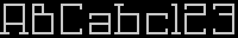

# High Score Cafe Atascii Generator

## Krótko, czym jest HSC

**High Score Cafe** (HSC) jest usługą udostępnioną przez *Krzysztofa XXL Dudka*, która gromadzi i prezentuje listy wyników użytkowników z gier, przeznaczonych na 8-bitowe komputery ATARI.

Przesyłanie wyników odbywa się na trzy różne sposoby:

- ręcznie dodanie za pośrednictwem serwisu HSC
- kod **QR** generowany w grze na małym ATARI
- **API HSC**, korzystające z urządzenia **FujiNet**.

Więcej na temat serwisu pod linkiem [High Score Cafe](https://xxl.atari.pl/hsc/)

## Czym jest HSC AtasciArt Generator?

Jest to skrypt rozszerzający możliwości HSC, pozwalający generować ekrany dla komputera ATARI z listą wyników danej gry oraz grafiką **AtasciiArt**.
Ekran jest generowany na podstawie przesłanego do serwisu pliku konfiguracyjnego. W postaci czytelnej dla małego ATARI, przesyłany jest do interfejsu **FujiNet** za pośrednictwem sieci Internet. Po odebraniu przez komputer danych, ekran może być wpisany bezpośrednio do pamięci ekranu komputera Atari, bez konieczności przetwarzania informacji.

Atutem takiego rozwiązania są:

- udekorowanie wyników grafiką **AtasciiArt**
- brak konieczności przetwarzania danych JSON po stronie ATARI
- szybki dostęp do listy wyników wielu gier.

## Co to jest Plik konfiguracyjny?

Jest to plik w formacie JSON. Opisuje on właściwości i elementy generowanego ekranu **AtasciiArt**.

    Ważne, aby pamiętać, że wielkość liter w nazwach sekcji, atrybutów oraz ich wartościach MA ZNACZENIE!

## Sekcja `layouts` - Definicje layoutów

Z punktu widzenia formatu JSON, `layouts` jest obiektem w którym umieszczone są definicje wyglądu ekranów. Każda taka definicja to osobny obiekt.

```JSON
{
 "layouts":{
  "default":{
   ...
  },
  "layout_1":{
   ...
  },
  "layout_1":{
   ...
  }
 }
}
```

Powyższy przykład, przedstawia poglądową definicję trzech ekranów (sub layoutów):

- nazwa `default` jest zarezerwowana dla domyślnego wyglądu
- `layout_1` i `layout_2` są dodatkowymi ekranami

### Definiowanie wyglądu ekranu

__Atrybuty wymagane:__

- `width`, `height` - szerokość i wysokość całkowita w znakach

  Domyślna wartość to 40 znaków.

  Wartości `width` z zakresu od 1 do 48. Można też używać predefiniowanych wartości:

  - `narrow` - szerokość 32 znaki
  - normal - szerokość 40 znaków
  - `wide` - szerokość 48

  Wartość `height` od 1 do 30.

- `lines` - tablica obiektów opisująca generowane linie

__Opcjonalne atrybuty:__

- `colors` - tablica reprezentująca ustawienia kolorów (wartości dla rejestrów od 708 do 712)
- `encodeLinesAs` - sposób wyjściowego kodowania treści generowanych linii
- `screenData` - tablica ciągów tekstowych opisująca zawartość ekranu bazowego (dane heksadecymalne)
- `screenFill` - znak, jakim będzie wypełniony ekran bazowy w przypadku, braku atrybutu `screenData`

## Sekcja `lines` - Definicje linii

Jest to tablica obiektów (w rozumieniu pliku JSON). Każdy obiekt w tej sekcji, definiuje osobną linię w ekranie bazowym.

__Atrybuty wymagane:__

- `x` i `y` - określające początkowe położenie linii w ekranie bazowym

__Opcjonalne atrybuty:__

- `width` oraz `height` - szerokość i wysokość linii.

  Domyślne wartości to: `height` = 1. Jeśli chodzi o `width` to ta wartość domyślnie dobierana jest na podstawie różnicy szerkości generowanego ekranu, a wartości X połoźenia linii.

- `invert`, ustawiony na `true`, dokonuje inwersji (operacja XOR na 7 bicie każdego znaku)  w wynikowej linii

Treść generowanej linii jest obcinana do jej szerokości oraz wysokości.

W sekcji tej, definiowane są też elementy wchodzące w skład linii.

### Elementy linii

Typ generowanego elementu zawarty jest w nazwie atrybutu obiektu opisującego generowaną linię tablicy `lines`

```JSON
{
 "layouts":{
  "default":{
   "lines":[
    {
     "x": 1,
     "y": 1,
     "width": 20,
     "element_type": {
      {element_attributes}
     },
     "element_type": {
      {element_attributes}
     },...
    },...
   ]
  }
 }
}
```

### Rodzaje elementów

- `place` - miejsce z tablicy wyników
- `nick` - nazwę gracza (jego nick)
- `score` - osiągnięty wynik
- `date` - datę rejestracji wyniku
- `text` - generuje dowolny tekst
- `genTime` - generuje czas utworzenia ekranu

Każdy element może posiadać etykietę. Jej nazwę definiujemy zaraz po typie elementu, poprzedzając ją znakiem kropki.

```JSON
{
 "text.label":{...}
}
```

Jest ona wymagana w przypadku chęci wstawienia kilku elementów tego samego typu.


### Atrybuty opisujące element

Poniższe atrybuty nie są wymagane, gdyż w przypadku ich braku wybierana jest wartość domyślna, jednak warto nad nimi panować, celem osiągnięcia zamierzonego efektu.

#### `offsetX` i `offsetY`

Definiują przesunięcie poziome oraz pionowe względem początku linii (w znakach)

Wartości domyślne dla obu atrybutów wynoszą 0 (zero)

#### `width` i `height`

Ustalają szerokość i wysokość generowanego elementu (w znakach)

Wartościami domyślnymi dla atrybutów `width` i `height` są, szerokość i wysokość definiowanej linii. 

#### `align`

justowanie zawartości względem podanej szerokości elementu (atrybut `width`)

Możliwe wartości to: `left`, `center`, `right`.

Wartość `right` jest domyślna.

#### `fillChar`

Określna znak, jakim będzie wypełniony element na całej jego szerokości.

Domyślną wartością jest znak #32 (spacja)

#### `letterCase`

Pozwala na konwersję wielkości liter.

Możliwe wartości: `uppercase`,`lowercase`

#### `limitChars`

Zawiera listę znaków, jaka będzie akceptowana przy generowaniu elementu. Jego opis to wartość typu string, zawierająca wszystkie akceptowane znaki.

W parze z tym atrybutem jest atrybut `replaceOutsideChars`.

Domyślnie akceptowane są wszystkie znaki.

#### `replaceOutsideChars` 

Ten atrybut określa znak, jaki będzie wstawiany w przypadku, gdy znak generowanego elementu nie należy do zakresu określonego w atrybucie `limitChars`.

Domyślną wartością jest #32 (spacja)

#### `invert` 

Działa tak samo jak atrybut `invert` w sekcji `scoreList` z tą różnicą, że stosowany jest tylko do generowanego elementu.

#### `useAtasciiFont` 

Generuje treść elementu z użyciem **AtasciiFont** (patrz dział [AtasciiFont](#AtasciiFont))

#### `isEntry`

Atrybut wskazujący na pobranie wyniku z tablicy wyników.

Przyjmuje dwa typy wartości:

- `boolean` - określające, czy pobierać wynik z tablicy wyników (wartość `true`, czy też nie (wartość `false`).
- `integer` - określająca, który wynik z tablicy wyników ma być pobrany

Ustalenie tego atrybutu tyczy się aktualnie definiowanej linii. Po przejściu do następnej, numer miejsca wyniku jest automatycznie zwiększany o jeden. Ustawienie wartości `false` powoduje, niezwiększanie numeru miejsca dla następnej linii.

Domyślną wartością jest `true`

**UWAGA!** Atrybut nie sprawdza zakresu! 


### Dedykowane atrybuty elementów

Spośród wszystkich elementów można wybrać takie, które mają przypisane dodatkowe atrybuty. Takimi elementami są:

- `score`
- `date`
- `genTime`
- `text`

#### Element `score`

Element wyniku `score` domyślnie interpretowana jest jako wartość 32-bitowa typu całkowitego (`longint`), przedstawiająca wynik punktowy osiągnięty przez gracza. Może być też przedstawiona jako czas, używając atrybutu `showScoreAs`

##### `showScoreAs`

Aby przekształcić wynik do formatu czasu, należy zdefiniować następujące atrybuty w elemencie `score`:

```JSON
{
 "showScoreAs": "time",
 "precision": 50,
 "format": "h.m.f"
}
```

- `showScoreAs` - wartość tego atrybutu określ jako `time`
- `precision` - określ dokładność z jaką będzie interpretowana wartość wyniku (1/n części sekundy)
- `format` - opisz format, który będzie zastosowany w wyniku.

##### `precision`

Czas zapisywany jest w postaci liczby całkowitej zawierającej część ułamkową, której dokładność określa atrybut `precision` w zakresie od 2 do 100. Wartość `precision` należy rozumieć jako część sekundy (1/n). Najlepiej będzie to zrozumieć, przedstawiając to w tabeli:

| wartość<br />wyniku | wartść<br />atrybutu<br />`precision` | rezultat |
| :-----------------: | :-----------------------------------: | :------: |
|          1          |               5 (1/5s)                |  00s.20  |
|          5          |                                       |  01s.00  |
|         51          |                                       |  10s.20  |
|          1          |              50 (1/50s)               |  00s.02  |
|          5          |                                       |  00s.10  |
|         55          |                                       |  01s.10  |

##### `format` 

Jest ciągiem znaków, który opisuje jakie części czasu będą wyświetlane. Znaczenie znaków w tym ciągu jest następująca:

- `h` - ilość godzin (bez zera wiodącego)
- `Hn` - ilość godzin, gdzie `n` określa ilość zer wiodących (jedna cyfra)
- `m` - ilość minut (z zerem wiodącym)
- `s` - ilość sekund (z zerem wiodącym)
- `f` - część ułamkowa sekundy (dwie cyfry)
- `Fn` - j.w. tylko n określa ilość miejsc po przecinku.

Nierozpoznane znaki w ciągu formatu zostaną przedstawione bez zmian.

#### Element `date`

##### `format`

Jest to ciąg znaków opisujących sposób, w jaki ma być interpretowana data powstania wyniku. Domyślnie stosowany jest format `Y.m.d`

Funkcją formatującą czas jest funkcja języka PHP `date()`. Jej opis znajdziesz [tu](https://www.php.net/manual/en/function.date.php), a możliwe opcje formatowania [tu](https://www.php.net/manual/en/datetime.format.php).

#### `Element `genTime`

Wyświetla serwerowy czas utworzenia ekranu.

##### `format`

Patrz opis atrybutów elementu `date`

#### Element  `text`

##### `content`

Użyj atrybutu `content` celem, określenia treści generowanego tekstu. Treść jest automycznie przycinana z obu stron pod kątem białych znaków.

W treści atrybutu, może być użyty parametr, np:

```JSON
...
"text":{
    content:"%id"
}
```

W miejscu `id` nalezy użyć identyfikatora, jaki zaostał użyty do przekazania parametrów do skryptu (patrz [Przekazywanie parametrów do HSC AAG](#Przekazywanie-parametrów-do-HSC-AAG))


## Sekcja `lineScheme` - Schematy definicji elementów

Aby ułatwić projektowanie schematu oraz zwiększyć czytelność pliku konfiguracyjnego, można stosować **schematy definicji elementów**.

Ich definicje opisuje się w głównej części pliku konfiguracyjnego w sekcji `lineSchemes` i jest ona obiektem (JSON) w którym zawarte są poszczególne schematy.

Każdy schemat jest obiektem (JSON) i musi być nazwany, np:

```JSON
{
  ...
  "lineSchemes": [
    "my_schema": {
      ...
    }
  ],
  ...
}
```

W definicji schematu można stosować wszystkie elementy i ich atrybuty, które zostały wymienione w sekcji [Elementy linii](#Elementy-linii).

Użycie schematu jest banalnie proste. W definicji linii wyniku wstawiamy atrybut `useSchema` któremu przypisujemy nazwę zdefiniowanego schematu (wielkość liter ma znaczenie!)

```JSON
{
 ...
 "lineSchemes": [
  "my_schema": {
   "x": 5,
   "width": 20,
   "place": {
    "shift": 1,
    "width": 2
    "align": right
   },
   ...
   "invertLine": false
  }
 ],
 "layouts": {
  "default":{
   ...
   "lines":[
    {
     "y": 5,
     "useSchema": "my_schema",
     "invert": true
    },
    {
     "y": 7,
     "useSchema": "my_schema"
    }
    ...
   ]
  }
  ]
}
```

Elementy i atrybuty zdefinsiowane w linii wyniku mają priorytet nad schematem, dzięki czemu, można nadpisywać ustawiane przez schemat cechy.


## AtasciiFont

**AtasciFont** to czcionki wykorzystujące zestaw znaków Atascii z małego ATARI.

W połączeniu z **HSC AtasciiArt Generator** zwiększają one możliwości kreowania ekranów i można je wykorzystać w każdym aspekcie na jaki pozwala HSC AAG.

### Dostępne czcionki

Obecnie stworzonych jest 8 czcionek.

| Nazwa pliku        | Nazwa czcionki     | Rozmiar |                        Przykład                        |
| ------------------ | ------------------ | :-----: | :----------------------------------------------------: |
| cosmic-line-2.json | Cosmic SquareLined |   3x3   |  |
| cosmic-line.json   | Cosmic Lined       |   3x4   |    |
| cosmic.json        | Cosmic             | 3(4)x3  |         |
| handwrite.json     | Handwrite          |   3x5   |      |
| round.json         | Round              | 3(4)x3  |          |
| square-bold.json   | Square Bold        | 3(4)x3  |    |
| square-slim.json   | Square Slim        |   3x3   |    |
| ultra-future.json  | Ultra Future       |   4x4   |   |

---

**Uwaga!** Nie wszystkie czcionki zawierają definicjie: małych liter oraz znaków interpunkcyjnych! Użycie niezdefiniowanego znaku, spowoduje jego nie wyświetlenie.

Zobacz [katalog podglądu czcionek](./AtasciiFonts/png_preview/), aby zobaczyć, jakie znaki są zdefiniowane w czcionkach.

---


### Jak korzystać z czcionek AtasciiFont w HSC AAG?

Aby użyć czcionki **AtasciFont** w pliku konfiguracyjnym, należy w definicji elementu umieści atrybut `useAtasciiFont`. W jego parametrze należy podać nazwę pliku czcionki bez rozszerzenia `.json`, np.

```JSON
...
"text":{
    "content":"ATARI RULEZ",
    "useAtasciiFont": "cosmic-line-2"
}
...
```

Należy też pamiętać o dobraniu wysokości linii do wysokości czcionki, gdyż skrypt nie robi tego automatycznie. W przeciwnym wypadku czcionka będzie ucięta.

```JSON
...
"lines":{
    height:3,
    "elements":{
        "text":{
            "content":"ATARI RULEZ",
            "useAtasciiFont": "cosmic-line-2"
        }
    }
}
...
```

Wszelkie atrybuty dostosowujące treść elementu są akceptowane dla **AtasciiFont**.


## Dla deweloperów

Na projekt HSC AAG składają się następujące katalogi i pliki:

| Nazwa                     | Opis                                                         |
| ------------------------- | ------------------------------------------------------------ |
| `/AtasciiFonts`           | definicje czcionek **AtasciiFont** oraz ich źródła i obrazy poglądowe |
| `/config_files_examples`  | przykłady i źródła plików konfiguracyjnych                   |
| `/default_configs`        | katalog z definicjami domyślnych plików konfiguracyjnych     |
| `/user_configs`           | zawiera pliki konfiguracyjne użytkowników                    |
| `_constants.php`          | definicje stałych dla klasy `AtasciiGen`                     |
| `_polyfill.php`           | funkcje zapewniające kompatybilność ze starszymi wersjami PHP |
| `_string_helpers.php`     | funkcje pomocnicze do operowania na ciągach znaków           |
| `class_AtasciiFont.php`   | klasa generująca tekst z użyciem czcionek **AtasciiFont**    |
| `class_AtasciiGen.php`    | klasa bazowa, generująca ekrany **AtasciArt**                |
| `class_HSCGenerator.php`  | rozszerzenie klasy bazowej, dostosowyujące do wymogów **HSC** |
| `example-AtasciiFont.php` | przykład użycia klasy `AtasciiFont`                          |
| `example.php`             | przykad użycia klasy `HSCGenerator`                          |
| `atari_8.png`             | obraz z graficzną reprezentacją znaków Atascii (rozmiar piksela 1x1) |
| `atari_16.png`            | j.w. (rozmiar piksela 2x2)                                   |


### Budowa klasy `AtasciiGen`

#### Właściwości klasy

#####  `$confFN`

| Widoczność | Typ    |
| ---------- | ------ |
| public     | string |

Przechowuje nazwę otwartego pliku konfiguracyjnego.

##### `$params`

| Widoczność | Typ   |
| ---------- | ----- |
| public     | array |

Jednowymiarowa tablica asocjacyjna zawierająca parametry które będą mogły być odczytane przez plik konfiguracyjny.

Asocjacja odbywa się poprzez klucz i jego wartość, gdzie nazwa klucza jest identyfikatorem parametru.


##### `$screenDef`

| Widoczność | Typ    |
| ---------- | ------ |
| private    | string |

Zmienna przechowująca wygenerowany ekran w postaci ciągu znaków Atascii. Rozmiar ciągu ustalany jest na podstawie wartości przekazanych przez plik konfiguracyjny w atrybutach layoutu `width` i `height`.

##### `$config`

| Widoczność | Typ   |
| ---------- | ----- |
| private    | array |

Zawiera zdekodowany do referencyjnej tablicy asocjacyjnej plik konfiguracyjny JSON.

##### `$schemes`

| Widoczność | Typ   |
| ---------- | ----- |
| private    | array |

Referencja do obiektu `$config['linesScheme']` zawierająca definicje schematów linii.

##### `$screenWidth` i `$screenHeight`;

| Widoczność | Typ     |
| ---------- | ------- |
| private    | integer |

Szerokość `$screenWidth` i wysokość `$screenHeight` generowanego ekranu. Wartości tych zmiennych ustalane są z definicji layoutu pliku konfiguracyjnego

##### `$curLineX` i`$curLineY`

| Widoczność | Typ     |
| ---------- | ------- |
| private    | integer |

Zmienne zawierają położenie lewego górnego rogu (kolumnę `$curLineX` i wiersz `$curLineY`) aktualnie przetwarzanej linii definicji layoutu.

##### `$curLineWidth` i `$curLineHeight`

| Widoczność | Typ     |
| ---------- | ------- |
| private    | integer |

Zawierają wymiary (szerokość `$curLineWidth` i wysokość `$curLineHeight`) aktualnie przetwarzanej linii definicji layoutu.

##### `$currentLineData`

| Widoczność | Typ   |
| ---------- | ----- |
| protected  | array |

Tablica ciągów znaków, której indeks reprezentuje numer przetwarzanej linii definicji layoutu.

##### `$elParams`

| Widoczność | Typ   |
| ---------- | ----- |
| private    | array |

Zawiera atrybuty aktualnie przetwarzanego elementu definicji linii.

#### Metody klasy

#####  __construct

| Widoczność |
| ---------- |
| public     |

| parametr | type   | wartość domyślna |
| -------- | ------ | ---------------- |
| `$fn`    | string | brak             |

Konstruktor, wczytujący i dekodujący plik konfiguracyjny w formacie JSON. W przypadku nieznalezienia pliku lub błędu w jego składni, funkcja wyrzuca wyjątek.

Ustala też tablicę layoutów oraz schematów linii.

##### getScoreboardEntry

| Widoczność |
| ---------- |
| public     |

| parametr | type    | wartość domyślna |
| -------- | ------- | ---------------- |
| `$place` | integer | brak             |

Metoda którą trzeba nadpisać poprzez rozszerzenie klasy `AtasciiGen`. Jej wywołanie wyrzuca wyjątek.

Funkcja jaką pełni to, pobieranie pojedynczego wyniki z tablicy wyników.

##### getScreenDataFromLayout

| Widoczność |
| ---------- |
| private    |

Metoda generująca ekran bazowy na podstawie atrybutów definicji layoutu `screenData` oraz `screenFill`.

`screenData` może być ciągiem znaków lub tablicą ciągów znaków. Treść ciągów to 8-bitowe wartości zapisane w systemie szesnastkowym opisujące znak po znaku (w jednym z dwóch standardów ATASCI lub ANTIC) ekran bazowy. 

##### rangeCheck

| Widoczność |
| ---------- |
| private    |

| parametr  | type    | wartość domyślna |
| --------- | ------- | ---------------- |
| `$value`  | integer | brak             |
| `$min`    | integer | brak             |
| `$max`    | integer | brak             |
| `$errMsg` | string  | brak             |

Metoda do kontroli zakresu wartości liczbowej, przekazywanej w parametrze `$value` . Zakres ustalany jest przez parametry `$min` i `$max`.

Metoda generuje wyjątek w przypadku przekroczenia zakresu, a treść tego wyjątku jest podawana w parametrze `$errMsg`. Do treści wyjątku "doklejana" jest informacja o oczekiwanym zakresie.

##### checkExist

| Widoczność |
| ---------- |
| private    |

| parametr   | type     | wartość domyślna                   |
| ---------- | -------- | ---------------------------------- |
| `$value`   | any type | brak                               |
| `$default` | integer  | null                               |
| `$errMsg`  | string   | `"Some atrribut is not specified"` |

Metoda kontrolująca istnienie parametru. Jest nieco "kontrowersyjna", gdyż opiera się o tryb "silent" PHP (operator @). W tym trybie, nie są generowane błędy, a wartość zwracana przez nieistniejący paramert przyjmuje `null`.Należy go dołączyć do przekazywanego parametru `$vaue`, np.

```PHP
$this>checkExist(@$this->config['name'], null);
```

Może reagować na dwa sposoby:

- generować wyjątek z komunikatem określonym w parametrze `$errMsg`. Ten sposób dostępny jest gdy, parametr `$default`
- przypisywać wartość `$default`, jeżeli `$value` 

##### parseLayoutBefore

| Widoczność |
| ---------- |
| protected  |

| parametr       | type  | wartość domyślna |
| -------------- | ----- | ---------------- |
| `&$layoutData` | array | brak             |


##### buildLineSchema

| Widoczność |
| ---------- |
| protected  |

| parametr    | type  | wartość domyślna |
| ----------- | ----- | ---------------- |
| `&$lineDef` | array | brak             |


##### parseLineBefore

| Widoczność |
| ---------- |
| protected  |

| parametr          | type  | wartość domyślna |
| ----------------- | ----- | ---------------- |
| `&$currentSchema` | array | brak             |


##### parseLineAfter

| Widoczność |
| ---------- |
| protected  |

| parametr          | type  | wartość domyślna |
| ----------------- | ----- | ---------------- |
| `&$layoutData`    | array | brak             |
| `&$currentSchema` | array | brak             |


##### generate

| Widoczność |
| ---------- |
| public     |


##### createElement

| Widoczność |
| ---------- |
| private    |

| parametr | type   | wartość domyślna |
| -------- | ------ | ---------------- |
| `&val`   | string | brak             |


##### parseElement

| Widoczność |
| ---------- |
| protected  |

| parametr      | type   | wartość domyślna |
| ------------- | ------ | ---------------- |
| `$elType`     | string | brak             |
| `$scoreEntry` | array  | brak             |
| `$label`      | string | null             |


##### makeImage

| Widoczność |
| ---------- |
| public     |

| parametr             | type   | wartość domyślna    |
| -------------------- | ------ | ------------------- |
| `$imageFile`         | string | null                |
| `$fontFile`          | string | DEFAULT_FONT_FILE   |
| `$defaultCharWidth`  | int    | DEFAULT_CHAR_WIDTH  |
| `$defaultCharHeight` | int    | DEFAULT_CHAR_HEIGHT |

Metoda tworzy na podstawie wygenerowanego ekranu (musi być wcześniej wywołana metoda `generate`) obraz PNG. Obraz jest tworzony z wykorzystaniem podanego w parametrze `$fontFile` pliku orazu czcionki w formacie PNG. Rozmiar pojedynczego znaku opisany jest parametrami `$charWidth` i `$charHeight`. Układ czcionek w pliku graficznym to 32 znaki na 8 znaków, z czego druga połowa (linie od 5-8) zawierać musi znaki w inwersie (specyfika czcionek ATARI 8-bit)

Jeżeli nie zostanie podany parametr `$imageFile`, metoda "wyrzuci" treść wygenerowanego obrazu w formacie PNG jako echo. Można tą cechę wykorzystać do generowania obrazów na żądanie stron HTML. Trzeba poprzedzić taki wynik ustawieniem nagłówka HTTP na `Content-Type: image/png`

### Rozszerzona klasa `HSCGenerator`

#### Stałe klasy

##### `USER_CONFIG_PATH`

="./users_configs/";


##### `DEFAULT_CONFIG_PATH`

="./default_configs/";


##### `DEFAULT_CONFIG_FILE`

="defaults";


##### `CONFIG_FILE_EXTENTION`

=".json";


##### `CONFIG_LAYOUTS_DEFAULT`

="default";


#### Właściwości klasy

##### private `$gameID`


##### private `$layoutID`


##### public `$scoreboard`

=[]


#### Metody klasy

##### public _construct

| Widoczność |
| ---------- |
| public     |

| parametr    | type   | wartość domyślna             |
| ----------- | ------ | ---------------------------- |
| `$gameID`   | string | null                         |
| `$layoutID` | string | self::CONFIG_LAYOUTS_DEFAULT |

Konstruktor klasy inicjujący klasę bazową `AtasciiGen`.

Jej zadaniem jest sprawdzenie istnienia pliku konfiguracyjnego dla `$gameID`. Jeżeli taki nie istnieje, ustawiany jest domyślny plik konfiguracyjny zapisany w stałej `self::DEFAULT_CONFIG_FILE`. Jeżeli domyślny plik nie istnieje, zwracany jest wyjątek.

Dodatkowo, przygotowuje odpowiedni layout w przypadku ustawienia parametru `$layoutID` na odpowiedni identyfikator.

W przypadku nieznalezienia identyfikatora `$layoutID` konstruktor zwraca wyjątek z klasy `AtasciiGen`.


##### public fetchScoreboardFromDB

Metoda pobierająca tablicę wyników z bazy danych. Wywoływana jest z poziomu konstruktora.


##### public getScoreboardEntry

| Widoczność |
| ---------- |
| public     |

| parametr | type | wartość domyślna |
| -------- | ---- | ---------------- |
| `$place` | int  | brak             |

Metoda pobierająca jeden wpis z tablicy wyników. Parametr `$place` zawiera miejsce w tablicy wyników liczone od 1.

Metoda MUSI zwrócić tablicę asocjacyjną o kluczach:

| nazwa klucza | typ wartości |
| ------------ | ------------ |
| `place`      | int          |
| `nick`       | string       |
| `score`      | int          |
| `date`       | int          |

np.

~~~php
return [
	"place"=>$place,
	"nick"=>$this->scoreboard[$place-1]["nick"],
	"score"=>$this->scoreboard[$place-1]["score"]
	];
~~~


### Przekazywanie parametrów do HSC AAG

Do skryptu można przekazywać parametry. Aby to uczynić, należy po zainicjowaniu nowej instancji `AtasciiGen` ale przed wygenerowanie ekranu dodać do zmiennej tablicowej `params` instanji wartości, np.

~~~PHP
// make new instance
$gen=new AtasciGen("config.json");

// add parameters
$gen->params[]="ATARI";
$gen->params[]="RULEZ";
$gen->params[]="AND BASTA";

// generate screen
$gen->generate();
~~~

W powyższym przykładzie, parametry będą dostępne dla pliku konfiguracyjnego pod nazwami `%0`, `%1`,`%2`.

Mozna używać asocjacji, celem czytelniejszego oznaczenia parametrów, np.

```PHP
// make new instance
$gen=new AtasciGen("config.json");

// add parameters
$gen->params["line1"]="ATARI";
$gen->params["line2"]="RULEZ";
$gen->params["line3"]="AND BASTA";

// generate screen
$gen->generate();
```

W takim przypadku, parametry będą dostępne pod nazwami `line1`,`line2`,`line3`.

### Tworzenie obrazów

TODO


# Podziękowania

Chciałem tu szczególnie podziękować osobom które wspierały ten projekt. Bez nich, prawdopodobnie nic by z niego nie było.

## XXL

Twórca serwisu **High Score Cafe**. Cierpliwie wdraża każdą moją aktualizację. Wspiera w utrzymaniu rozszerzenia oraz podaje świetne pomysły.

## KAZ

Twórca serwisu **AtariOnLine**. Pomocna dusza ;) Udzielił dostępu do serwisu, celem utworzenia artykułu o HSC. Dostarcza nie lada emocji, widząc ciekawe rzeczy (m.in. HSC AAG) - to budujące!

---

**Osoby niewymienione, nie powinny czuć się niedocenione. Ich komentarze są równie cenne, co wkład osób przedstawionych powyżej :)**

---
