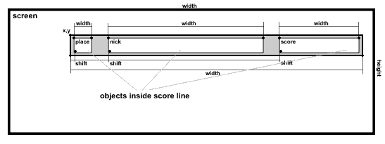

# High Score Cafe Atasci Generator

## Krótko, czym jest HSC

High Score Cafe (HSC) jest usługą udostępniona przez Krzysztofa XXL Dudka, która gromadzi i prezentuje listy wyników użytkowników z gier, przeznaczonych na 8-bitowe komputery ATARI.

Przesyłanie wyników odbywa się na trzy różne sposoby:

- ręcznie dodanie za pośrednictwem serwisu HSC
- kod QR generowany w grze na małym Atari
- API HSC, korzystające z urządzenia FujiNet.

Więcej na temat serwisu pod linkiem [High Score Cafe](https://xxl.atari.pl/hsc/)

## Czym jest HSC Atasci Generator?

Jest to skrypt napisany w języku PHP, pozwalający generować ekrany dla komputera ATARI z listą wyników danej gry oraz grafiką AtasciART.
Ekran jest generowany po stronie serwera na podstawie pliku konfiguracyjnego w formacie JSON i w postaci czytelnej dla małego ATARI, przesyłany do interfaceu FujiNet. Po odebraniu przez komputer danych, ekran może być wyświetlony bezpośrednio do pamięci ekranu, bez konieczności przetwarzania informacji.
Atutem takiego rozwiązania są:

- udekorowanie wyników grafiką AtasciArt
- brak konieczności przetwarzania danych JSON po stronie Atari
- szybki dostęp do listy wyników wielu gier.

## Co to jest Plik konfiguracyjny?

Plik konfiguracyjny to plik w formacie JSON.

    Ważne, aby pamiętać, że wielkość liter w nazwach atrybutów oraz ich wartościach MA ZNACZENIE!
    Kolejność występowania atrybutów, nie ma znaczenia.

Jego pierwszy (najwyższy) poziom, definiuje właściwości szablonu takie jak:

- `width`, `height` - szerokość i wysokość całkowita w znakach. **Te atrybuty są wymagne!**
- `colors` - tablica reprezentująca ustawienia kolorów (wartości dla rejestrów od 708 do 712)
- `encodeAs` - sposób kodowania linii wyników
- `layout` - tablica obiektów opisująca wygląd poszczególnych linii wyników. **Ten atrybut jest wymagany.**
- \* `screenFile` - plik binarny z zawartością ekranu
- \* `screenData` - tablica ciągów tekstowych opisująca zawartość ekranu (dane heksadecymalne)

_\* Jeden z dwóch atrybutów MUSI być określony w pliku._

Istotną kwestią jest rozpatrywanie atrybutów `screenFile` i `screenData`. W pierwszej kolejności brany jest pod uwagę atrybut `screenData`, a jeżeli nie jest określony to pobierane są dane z pliku opisanego w `screenFile`. Jeżeli są zdefiniowane oba atrybuty, priorytet będzie miał atrybut `screenData`!

## Opis listy wyników. Tablica objektów `Layout`

Każda linia wyniku opisana jest osobnym obiektem. Aby zrozumieć istotę objektowosci, najlepiej posłużyć się grafiką:



W obiekcie wymagane są następujące atrybuty:

- `x` i `y` - określające początkowe położenie linii wyniku.
- `width` - szerokość linii wyniku.

Do opisu zawartości linii wyniku stosuje się opcje:

- `place` - generuje miejsce
- `nick` - generuje nazwę gracza (jego nick)
- `score` - generuje osiągnięty wynik.
- `date` - generuje datę rejestracji wyniku.

Specjalną opcją jest atrybut `inversLine`, który ustawiony na `true` generuje tekst w odwróconych kolorach (operacja XOR na 7 bicie każdego znaku linii)

Powyższe opcje to obiekty i każdy z nich MUSI mieć zawarte atrybuty:

- `shift` - przesunięcie względem początku linii (w znakach)
- `width` - szerokość generowanej wartości (w znakach)

Opcjonalnie, każdy z objektów może posiadać atrybuty:

- `align` - justowanie zawartości względem podanej szerokości objektu (atrybut `width`) Możliwe wartości to: `left`, `center`, `right`. Wartość `right` jest domyślna.
- `fillChar` - znak, jakim będzie wypełniony objekt na całej jego szerokości. Domyślną wartością jest znak #32 (spacja)
- `uppercase` - (ustawiony na wartość `true`) konwertuje znaki alfabetu na wielkie. Domyślnie ustawiony na `false`
- `lowercase` - (ustawiony na wartość `true`) konwertuje znaki alfabetu na małe. Domyślnie ustawiony na `false`
- `limitChars` - zawiera zestaw znaków, jaki jest akceptowany przy wyświetlaniu. Jego opis to wartość typu string, zawierająca wszystkie chciane znaki. W parze z tym atrybutem jest atrybut `replaceOutsideChars`. Domyślnie akceptowane są wszystkie znaki.
- `replaceOutsideChars` - ten atrybut określa znak, jaki będzie wstawiany w przypadku, gdy znak objektu nie należy do zakresu określnego w atrybucie `limitChars`. Domyślną wartością jest #32 (spacja)
- `invert` - działa tak samo jak atrybut `inversLine` w sekcji `scoreList` z tą różnicą, że stosowany jest tylko do generowanego objektu.

## Dodatkowe atrybuty opcji

Opcje `score` i `date` posiadają dodatkowe atrybuty, które rozszerzają interpretację wartości.

### Atrybuty dla opcji `score`

Opcja wyniku domyślnie interpretowana jest, jako wartość 32-bitowa typu całkowitego (przedstawiająca wynik punktowy osiągnięty przez gracza). Może być też przedstawiona jako czas.

Czas zapisywany jest w postaci liczby całkowitej zawierającej część ułamkową, której dokładność określa atrybut `precision` w zakresie od 2 do 100. Wartośc `precision` należy rozumieć jako część sekundy 1/n. Najlepiej będzie to zrozumieć, przedstawiając to w tabeli:

| `score` | `precision` | rezultat |
| ------- | ----------- | -------- |
| 1       | 5 (1/5s)    | 00s.20   |
| 5       |             | 01s.00   |
| 51      |             | 10s.20   |
| 1       | 50 (1/50s)  | 00s.02   |
| 5       |             | 00s.10   |
| 55      |             | 01s.10   |

Aby przekształcić wynik do formatu czasu, należy zdefiniować następujące atrybuty w opcji `score`:

- `showScoreAs` - wartość tego atrybutu określ jako `time`
- `precision` - określ dokładność z jaką będzie interpretowana wartość wyniku (1/n części sekundy)
- `formatTime` - opisz format, który będzie zastosowany w wyniku.

`formatTime` jest ciągiem znaków, który opisuje jakie części czasu będą wyświetlane. Znaczenie znaków w tym ciągu jest następująca:

- `h` - ilość godzin (bez zera wiodącego)
- `Hn` - ilość godzin, gdzie `n` określa ilość zer wiodących (jedna cyra)
- `m` - ilość minut (z zerem wiodącym)
- `s` - ilość sekund (z zerem wiodącym)
- `f` - część ułamkowa sekundy (dwie cyfry)
- `Fn` - j.w. tylko n określa ilość miejsc po przecinku.

Nierozpoznane znaki w ciągu formatu zostaną przedstawione bez zmian.

### Atrybuty dla opcji `date`

Atrybutem rozszerzającym opcje `date` jest `formatDate`. Jest to ciąg znaków opisujących sposób, w jaki ma być interpretowana data powstania wyniku. Domyślnie stosowany jest format `Y.m.d`

Funkcją formatującą czas jest funkcja języka PHP `date()`. Jej opis znajdziesz [tu](https://www.php.net/manual/en/function.date.php), a możliwe opcje formatowania [tu](https://www.php.net/manual/en/datetime.format.php).

## Schematy definicji linii

Aby ułatwić projektowanie schematu oraz zwiększyć czytelność pliku konfiguracyjnego, można stosować **schematy definicji linii**.

Ich definicje opisuje się na najwyższym poziome pliku koniguracyjnego, tworząc tablicę objektów `schemes`.
Każdy schemat jest obiektem i musi być nazwany, np:

```JSON
{
  ...
  "schemes": [
    "my_schema": {
      ...
    }
  ],
  ...
}
```

W definicji schematu można stosować wszystkie objekty i ich atrybuty, które zostały wymienione w sekcji [Opis listy wyników. Tablica objektów `Layout`](#opis-listy-wyników.-tablica-objektów-Layout).

Użycie schematu jest banalnie proste. W definicji linii wyniku wstawiamy atrybut `useSchema` któremu przypisujemy nazwę zdefiniowanego schematu (wielkość liter ma znaczenie!)

```JSON
{
  ...
  "schemes": [
    "my_schema": {
      "x": 5,
      "width": 20,
      "place": {
        "shift": 1,
        "width": 2
        "align": right
      },
      ...
      "invertLine": false
    }
  ],
  "layout": [
    {
      "y": 5,
      "useSchema": "my_schema",
      "invertLine": true
    },
    {
      "y": 7,
      "useSchema": "my_schema"
    }
    ...
  ]
}
```

Obiekty i atrybuty zdefiniowane w linii wyniku, mają priorytet nad schematem, dzięki czemu, można nadpisywać ustawiane przez schemat cechy.

Już prościej się (chyba) nie da ;) Znaczy się, da, tylko to już jest przerost formy nad treścią.
